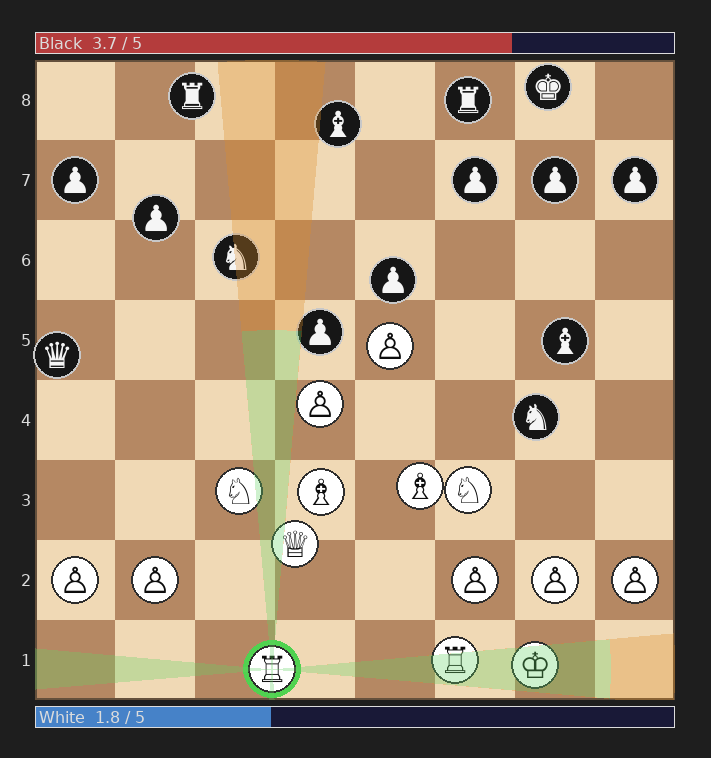

# Continuous Chess



A real-time chess variant where both players move simultaneously on a continuous board. Instead of taking turns, you spend mana to queue moves and everything happens simultaneously.

(The project was called Indiscreet Chess; the deployed hostnames still say so, since renaming them would change the link people have.)

**[Play in your browser](https://indiscreet-chess.indiscreet-chess-web.workers.dev)** - nothing to install. Create a room and share the code, or take whoever is waiting.

## How It's Different From Regular Chess

- **Real-time, not turn-based.** Both players act simultaneously.
- **Mana economy.** Every move costs mana (base cost + distance). Mana regenerates over time. You share a pool of up to 5.0 mana.
- **Continuous positions.** Pieces glide smoothly rather than snapping between squares.
- **Capture by collision.** A moving piece captures an enemy when their hitboxes touch. If both pieces are moving when they collide, both are removed (mutual capture).
- **No check or checkmate.** The goal is to physically capture the enemy King.

## Rules

### The Board and Pieces

The board is a continuous 2D plane equivalent to an 8×8 grid. There are no discrete squares, rather pieces have circular hitboxes and can occupy any position. All distances and movements are fully continuous.

### Mana

Each player has a mana pool that regenerates over time up to a maximum of 5.0. Every move costs **base cost + distance × rate** mana, deducted immediately when the move is queued. If you don't have enough mana, you can't queue the move.

### Move Phases

Every queued move goes through four phases:

1. **Deduction** - mana is taken immediately.
2. **Preparation** - a brief delay before the piece starts moving. The piece stays put. If it's captured here, the move is cancelled and mana is not refunded.
3. **Movement** - the piece travels in a straight line to its destination at constant speed.
4. **Cooldown** - after arriving, the piece cannot move and cannot receive new orders for a short period.

A new move can only be queued when the piece is idle (not in any phase) and you have sufficient mana.

### Capture

- A moving piece captures an enemy the instant their hitboxes touch.
- If **both** pieces are moving when they touch, both are removed (mutual capture).
- After capturing, a piece continues toward its original destination (stopping at the captured piece's perpendicular or the destination, whichever comes first).
- Each piece can capture at most **one** enemy per move. The Knight is the only exception.
- A moving piece that would hit a friendly piece (or has already used its capture for this move) stops at the point of contact instead. This holds for every piece and every kind of move: nothing can capture its own side.
- If a piece is captured during its preparation period, the queued move is cancelled, and mana is not refunded.

### Piece Movement

**Rook, Bishop, Queen** - move in their standard chess directions (orthogonal, diagonal, or both) with no distance limit.

**King** - moves in any direction, up to 1 square orthogonally or √2 squares diagonally.

**Pawn** - moves strictly forward, up to 1 square. Cannot capture pieces by moving forward. If it contacts any piece while moving forward, it stops. It can be captured by enemies moving into it.

**Knight** - jumps to one of 8 L-shaped zones. While in transit it cannot be captured and cannot capture. On arrival it captures **all** pieces (friend or foe) whose hitboxes overlap with it. If any of those pieces were moving at the moment of arrival, the Knight is also removed.

### Special Moves

**Pawn - Double Move**
If the pawn's center has never left its starting square, it may move forward up to two squares instead of one.

**Pawn - Diagonal Capture**
A pawn can be sent to one of two forward-diagonal landing zones (one square sideways, one square forward). This move is only legal if an enemy piece is already close enough to that landing point when the move is queued. While traveling diagonally the pawn cannot be captured and passes straight through enemy pieces - but **its own side still blocks it**: a friendly piece in the way stops it at the point of contact, and the move ends there having captured nothing. On arrival it captures **one** enemy: the nearest overlapping the landing position. It does not clear the square the way a Knight does, so landing between two enemies is a choice of one. If that enemy was moving on arrival, the pawn is removed as well. If everything moved away before the pawn lands, it arrives safely and captures nothing.

**En Passant**
When a pawn executes a double move, it leaves a ghost at the point where it crossed the 3rd rank (White) or 6th rank (Black). An enemy pawn can capture this ghost, which also removes the original pawn. The ghost disappears the next time the opponent queues any move other than capturing it.

**Pawn Promotion**
When a pawn's **centerpoint** enters the last rank, it promotes to a Queen. Any movement already in progress continues to its destination, and a move that was queued as a diagonal capture still resolves as one - promotion changes what the piece is, never what its current move has already spent, so it cannot buy a second capture.

**Castling**
When neither the King nor a Rook has previously moved, the King can castle by moving 1-2 squares directly sideways toward that Rook. Both pieces begin moving simultaneously. The Rook is timed to arrive adjacent to the King's destination at the same moment the King arrives causing them to briefly overlap during transit. If either piece is blocked before the overlap begins, neither overlaps. If the Rook is blocked after that, the King continues until it contacts the stopped Rook. If the Rook is captured, the King continues unaffected.

### Civilizations

Both players secretly pick a civilization before the game. Each one is a set of
percentage changes to the base settings - mana, tempo, aim, and **piece size** -
priced on a shared points budget, so a pick is a style rather than an advantage.
`node --experimental-strip-types tools/civ_table.mjs` prints the whole table,
names any civilization that is off zero, and fails if one drifts more than a
quarter point. The budget is not held to the last decimal on purpose: the
per-piece rows are priced with estimates of how often each piece moves, and
bending an exact number to cancel an estimated one is arithmetic, not balance.

A larger piece blocks a file and reaches an enemy sooner, but is a bigger target
and gets stopped by its own side more often. The budget assumes smaller is
mildly better; that assumption is the one most worth testing.

### Settings

Set by whoever opens the room, and applied to both players:

- **Tempo** - bullet, rapid or slow.
- **What players can see** - the opponent's mana, their preparation, their
  cooldowns, and where their moves are headed, each on or off. Hidden
  information is filtered on the server and never sent, so it cannot be read
  out of the connection. By default you see everything except their mana.

Personal, stored in your browser and affecting nobody else:

- **Moving a piece** - drag, click, or both.
- **Shortest drag that counts as a move** - below it a drag only selects. Lower
  it on a touchscreen, where a very short move is otherwise unreachable.
- **Move hints** on or off.
- Hold **Shift** - or press **Precise** on the board, for a touchscreen - to let
  any drag distance count as a move and to brighten the hints.

### After the game

The result screen offers a replay of the game just played at 0.5×, 1×, 2× or 4×,
with a scrubber, and a button back to a new game. The recording is the snapshots
the server already sent, held in the tab: nothing is stored anywhere, and it
shows the game as you saw it, hidden information included.

### Victory and Draw

- Win by capturing the enemy King.
- There is no check or checkmate, the King is free to move into danger.
- If two Kings capture each other simultaneously, the game is a draw.
- A Knight that lands on its own King removes it, losing the game.
- There are no other draw conditions.

## Install

Requires Python 3.11+ and pip.

```bash
pip install -r requirements.txt
```

## Play

```bash
python host.py
```

Choose a mode from the menu:

| Mode | Description |
|------|-------------|
| **Solo** | Control both colors yourself - good for learning |
| **Host** | Start a server and play as White; share your IP and port with your opponent |
| **Join** | Enter a host's IP and port to connect and play as Black |

Click a piece to select it, then click a destination to queue a move. The mana bar shows your current pool.

## Playing with a Friend

**Same local network (e.g. home Wi-Fi):**

1. The host runs `python host.py` and selects **Host**. Note the IP shown, or find it with `hostname -I` (Linux/Mac) or `ipconfig` (Windows).
2. The guest selects **Join** and enters the host's local IP and port.

**Different network (over the internet):**

The host needs to make their port reachable. Two options:

- **Port forwarding** - forward the chosen port to your machine in your router settings, then share your public IP (e.g. from [whatismyip.com](https://whatismyip.com)).
- **Tailscale / ZeroTier** - install the same VPN app on both machines. They'll appear on a shared virtual network, so use the Tailscale/ZeroTier IP the same as a local one.
